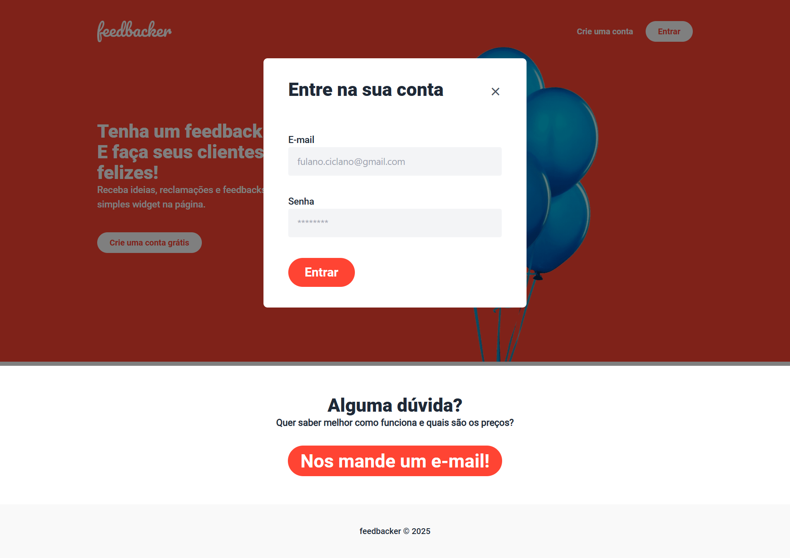
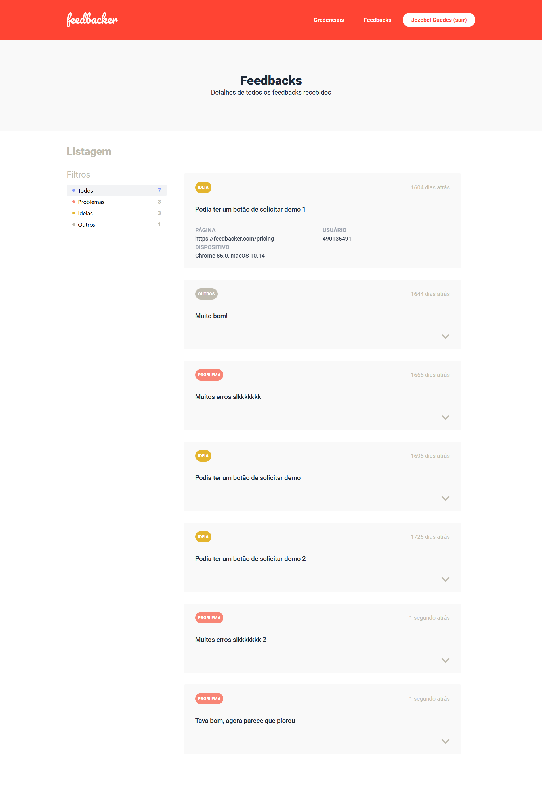
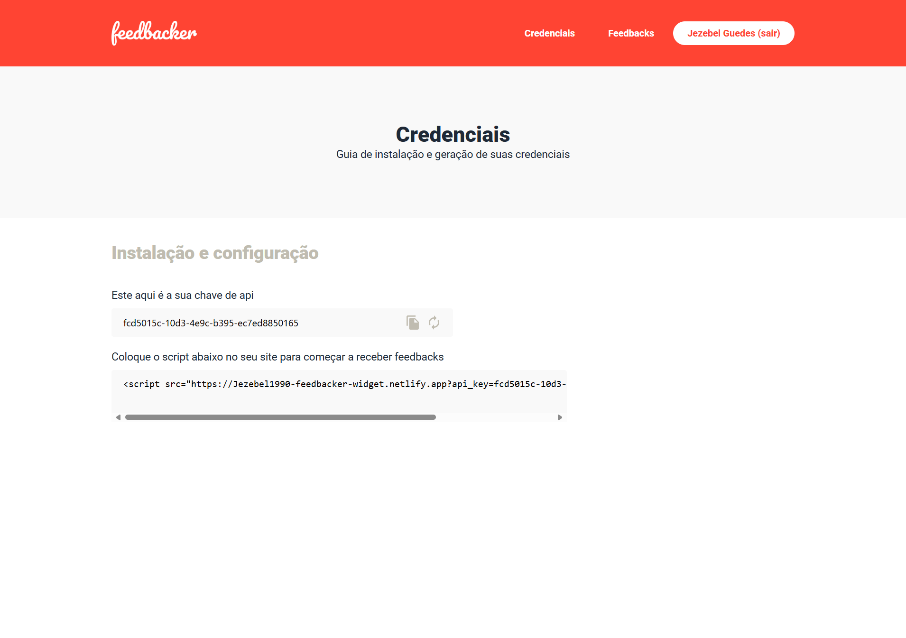

# 📊 Feedbacker Dashboard
> Dashboard para visualização e gerenciamento de feedbacks recebidos via sistema Feedbacker. Projeto desenvolvido com foco em performance, testes automatizados e estilização moderna.






## Tecnologias Utilizadas

- **JavaScript**
- **Vue.js 3**
- **Tailwind CSS**
- **Jest** – Testes unitários
- **Cypress** – Testes end-to-end

## Credenciais de Acesso

Para acessar o painel de administração, utilize as credenciais abaixo:
```json
{
  "email": "jezebel@jezebel.me",
  "password": "1234"
}
```

## Rodando os Testes

### Testes Unitários (Jest)
``` bash
npm run test:unit
```

### Testes End-to-End (Cypress com interface)
``` bash
npm run test:e2e
```

### Rodar Cypress sem interface (modo headless)
``` bash
./node_modules/cypress/bin/cypress run
```

## Docker

###  Build da imagem Docker
``` bash
docker build -t feedbacker-dashboard .
```

### Executar container
``` bash
docker run --name feeddash -p 80:80 feedbacker-dashboard
```

## Instalação do Projeto
1. Instalar dependências
``` bash
npm install
```
2. Rodar em modo desenvolvimento
``` bash
npm run serve
```
3. Gerar build para produção
``` bash
npm run build
```
4. Corrigir e formatar arquivos com lint
``` bash
npm run lint
```

## Licença

Este projeto está licenciado sob a Licença MIT. Consulte o arquivo LICENSE para mais informações.

Feito com ♥ por [Jezebel Guedes](https://www.linkedin.com/in/jezebel-guedes/) 👋 Entre em contato!